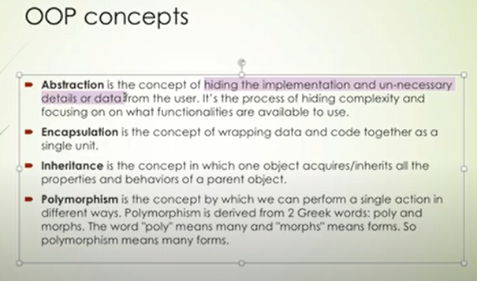

**Class**
The class can be defined as a collection of objects. It is a logical entity that has some specific attributes and methods.

**Object**
The object is an entity that has state and behavior. It may be any real-world object like the mouse, keyboard, chair, table, pen, etc.

Everything in Python is an object, and almost everything has attributes and methods. All functions have a built-in attribute __doc__, which returns the docstring defined in the function source code.

When we define a class, it needs to create an object to allocate the memory. 

**Inheritance**
simulates the real-world concept of inheritance. It specifies that the child object acquires all the properties and behaviors of the parent object.

By using inheritance, we can create a class which uses all the properties and behavior of another class. The new class is known as a derived class or child class, and the one whose properties are acquired is known as a base class or parent class.

It provides the re-usability of the code.

**Polymorphism**
Polymorphism contains two words "poly" and "morphs". Poly means many, and morph means shape. By polymorphism, we understand that one task can be performed in different ways. 

**Encapsulation**
It is used to restrict access to methods and variables. In encapsulation, code and data are wrapped together within a single unit from being modified by accident.

**Data Abstraction**
data abstraction is achieved through encapsulation.

Abstraction is used to hide internal details and show only functionalities. Abstracting something means to give names to things so that the name captures the core of what a function or a whole program does.

* In python, we can also perform data hiding by adding the double underscore (___) as a prefix to the attribute which is to be hidden. After this, the attribute will not be visible outside of the class through the object.

**Python Constructor**
A constructor is a special type of method (function) which is used to initialize the instance members of the class.