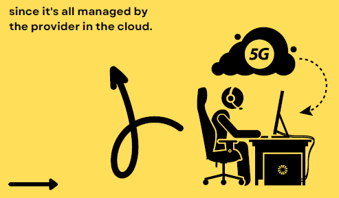

**Defining the cloud**

Do you use Facebook, Twitter, Dropbox, YouTube, Gmail, or other social media?

Do you use a PC, tablet or phone to interact with these tools?

If so you are already using the cloud for social interaction, file storage and communication.

**Mell and Grance (2011, p. 2) defined cloud computing as:**

Cloud computing is a model for enabling ubiquitous واسع الانتشار , convenient, on-demand network access to a shared pool of configurable computing resources (e.g., networks, servers, storage, applications, and services) that can be rapidly provisioned and released with minimal management effort or service provider interaction.

**The three service models defined by NIST are:**

- The NIST (National Institute of Standards and Technology)

1. **Software as a Service (SaaS):**
The consumer uses provider’s applications running on a cloud infrastructure. Accessible from various client devices through either a thin client (web browser).

* The consumer does not manage or control the underlying
cloud infrastructure including network, servers, operating systems, storage.

2. **Platform as a Service (PaaS):** 
The consumer can deploy onto the cloud infrastructure consumer-created or acquired applications created using programming languages, libraries, services, and tools supported by the provider.

* The consumer does not manage or control the underlying
cloud infrastructure including network, servers, operating systems, or storage, but has control over the deployed applications and possibly configuration settings for the application-hosting environment.

3. **Infrastructure as a Service (IaaS):** 
The consumer can provision processing, storage, networks, and other fundamental computing resources where the consumer is able to deploy and run arbitrary software, which can include operating systems and applications.

* The consumer does not manage or control the underlying cloud infrastructure but has control over operating systems, storage, and deployed applications; and possibly limited control of select networking components.

____________________

* The physical layer represents the actual hardware required to host the cloud service, and the abstraction layer represents the software deployed to implement the service.

* The abstraction layer contains the three service models in a hierarchy to represent the fact that cloud services can be composed of one or more other cloud services.

* So, a company that wants to offer an SaaS to the general public (e.g. a mobile app) could do so by contracting for a PaaS, and the provider of the PaaS could build on the offerings of an IaaS.

___________________

**Deployment models of the cloud:**

NIST cloud describes four different deployment models, as follows:

1. **Private cloud:** The cloud infrastructure is provisioned for exclusive use by a single organization comprising multiple consumers (e.g., business units).

   * It may be owned, managed, and operated by the organization, a third party, or some combination of them, and it may exist on or off premises.

2. **Community cloud:** The cloud infrastructure is provisioned for exclusive use by a specific community of consumers from organizations that have shared concerns (e.g., mission, security requirements, policy, and compliance considerations).

   * It may be owned, managed, and operated by one or more of the organizations in the community, a third party, or some combination of them, and it may exist on or off premises.

3. **Public cloud:** The cloud infrastructure is provisioned for open use by the general public.

   * It may be owned, managed, and operated by a business, academic, or government organization, or some combination of them. It exists on the premises of the cloud provider.

4. **Hybrid cloud:** The cloud infrastructure is a composition of two or more distinct cloud infrastructures (private, community, or public).

__________________

* Software as a Service (SaaS) is an application delivery model

* Where software and associated data are hosted in the cloud and made available to customers over the internet.

* SaaS applications are typically accessed using a web browser, but they may also be accessible from mobile devices.

* The main advantage of SaaS is that it eliminates the need for customers to install and maintain their software and hardware,

* This makes it much simpler for companies to deploy new applications quickly without any complicated setup or maintenance tasks.

* Additionally, SaaS providers can offer scalability, so you only pay for the resources you need.

* Finally, SaaS enables multi-tenancy, so many customers can access the same application at once without performance issues.

* In conclusion, SaaS is a convenient and cost-effective way to access software applications in the cloud, with minimal setup and maintenance requirements.

