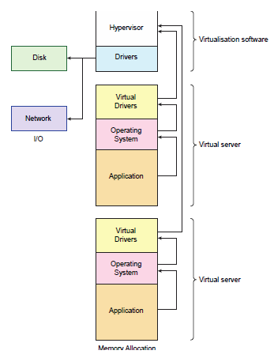
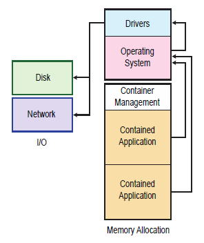
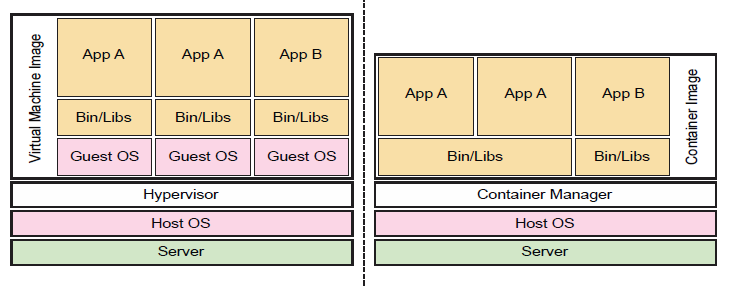

**Virtualisation:** is the core technology of the cloud and has emerged ظهرت as a result of improvements in the design of processor chips.

____________

 **Virtual machines:**

**The virtual machine form of virtualization:**
*  takes the resources of a single physical host computer (CPUs, memory and input/output devices)
* And shares them between multiple guest computers.
____________

**Each guest** appears to be an independent self-contained computer with its own processor, memory and peripherals, running a standard operating system.

_____________

The **virtualisation software, or hypervisor**, provides the code to manage and protect the virtual servers, together with the code for device drivers.

It is **responsible for**
* creating each virtual server,
* protecting a virtual server’s memory space from other virtual servers,
* scheduling usage of the processors and
* Cleaning up when a virtual server is disposed of.

However, the device drivers of the guest OS have been replaced with what I have called ‘virtual drivers’; they are virtual because they do not directly control any input/output devices

_________________

## Containers

**Virtual machines** come with a significant overhead, the operating system, which has to be loaded before any application can start.

**A guest OS consumes a lot of memory to store the code that will:**
* manage memory,
* schedule processes,
* buffer disk drive reads
* and writes and communicate over a network.

**Problem:**

Loading a full virtual machine image from storage also takes time as it has to go through the full ‘boot-up’ procedure

**Solution:**

The solution to overcome the resource and time overhead is the application container, **essentially a file containing an application and associated libraries.**

**The important difference** is that an application container has no separate operating system and is, therefore, much smaller: megabytes instead of gigabytes.

________

**Containers**

In the VM model, shown on the left, each VM requires a guest OS, even though two of the VMs run the same application – in this case ‘App A’.

In the container model, shown on the right, if two containers run the same application they can share any common functionality, such as the middleware represented by the ‘Bin/Libs’ layer.

